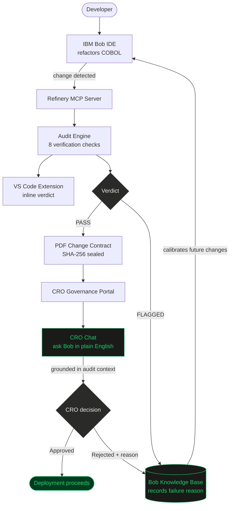

# Refinery

IBM Bob modifies the COBOL. Refinery checks the work.

Built for the IBM Bob Hackathon 2026.

---

## The problem

The average COBOL programmer is over 55. The systems they maintain process $3 trillion a day: payroll, clearing, insurance, pensions. The people who understand them are retiring, and there is nobody coming up behind them fast enough.

IBM Bob can read the code and suggest changes. But the code is not the whole picture. The tolerance thresholds, the edge cases that got hardcoded after an incident in 1987, the reason this field is COMP-3 and not COMP: none of that is in the source file. It lives in one person's head. When that person leaves, it is gone.

Refinery captures it. Every flag, every CRO rejection, every "this is wrong because" gets recorded and fed back into Bob's knowledge base. Bob stops repeating the same mistakes on your estate because it now has your history.

---

## Product flow



---

## How it works

### Bob modifies the COBOL

Bob optimises or refactors a COBOL program in the IDE. Refinery intercepts the change and runs its audit pipeline. If something is wrong, the verdict appears immediately: FLAGGED, with a risk score, before anything gets committed.


### The audit

Eight checks run. Each either passes or flags. A flagged change gets a PDF change contract with a SHA-256 hash for chain of custody.

| Check | What it asks |
|---|---|
| Arithmetic equivalence | Does the calculation produce the same result? Catches COMPUTE rewrites that introduce rounding drift or precision loss. |
| Data types | Are PIC clauses, COMP-3 fields, and decimal precision unchanged? A type change that looks harmless can silently corrupt downstream data. |
| Control flow | Does the program follow the same logical path? Verifies that IF/ELSE branches and PERFORM loops behave identically. |
| Memory layout | Are field boundaries and offsets the same? Checks REDEFINES clauses and copybook layouts that other programs depend on. |
| Call graph | Does it call the same programs in the same order? A reordered or removed CALL can break dependent systems that expect a specific sequence. |
| Compiled output | Does the compiled code produce the same results across all test inputs? Runs the original and modified versions side by side. |
| Error paths | Do error and exception conditions behave the same? Checks ON SIZE ERROR, NOT ON SIZE ERROR, and other condition handlers. |
| I/O behaviour | Are file reads and writes unchanged? Verifies READ, WRITE, and REWRITE statements and VSAM dataset access patterns. |

### Blast radius

A change can pass all eight verification checks and still break something. One COBOL program is rarely just one COBOL program. It gets called by batch jobs, its copybooks are shared with siblings, it writes to VSAM datasets that other programs read. The code is fine. The system is not.

Refinery traces every `CALL`, `COPY`, `ASSIGN TO`, JCL `EXEC PGM`, and `DSN` reference across the estate and scores the result from 0 to 100. Above 50, the CRO must sign off before anything ships.

Four things go into the score: programs that directly call the changed module, programs sharing the same copybook (a layout mismatch here causes field offset errors that tend to surface days later in production), programs reading or writing the same VSAM datasets, and JCL batch jobs that execute the changed program.

The reason this works is IBM Bob's full repo view. Most analysis tools look at one file. Bob ingests the whole repository, so Refinery can trace dependencies that would be invisible from a single file's context. The blast radius score reflects the actual estate, not an approximation of it.

### The feedback loop

Every flagged verdict and every CRO rejection goes back into Bob's RAG knowledge base. Next time Bob touches the same program or a similar pattern, it has the history of what failed and why:

- What the change was and which check caught it
- What the semantic difference was
- Why the CRO rejected it (e.g. "data type boundary violated on COMP-3 field")

Bob does not stay generic. It gets progressively more accurate on your specific estate because it is learning from your actual compliance failures, not someone else's.

### Governance dashboard

Every audit lands in the governance portal. The CRO sees verdicts, risk scores, blast radius scores, and sign-off status.


### CRO sign-off

When blast radius exceeds the threshold, the CRO must approve before the change ships. The record locks once submitted. The reason given goes back into Bob's knowledge base so the same mistake does not get made twice.


### CRO chat

CROs are not engineers. They should not have to read a diff to decide whether a change is safe to ship.

Each audit record in the portal has a chat tab. The CRO opens it, the full audit context is pre-loaded, and they can ask plain English questions: "What systems does this affect?", "Does this change violate DORA Article 16?", "Why was this flagged and not the previous one?" Bob answers using the audit data and the RAG knowledge base. The response is grounded in the specific change in front of them, not a generic LLM answer.


---

## Running it

### Streamlit app (main demo)

```bash
pip install uv
uv sync
uv run streamlit run streamlit_app/app.py
```

### CRO portal

```bash
uv run uvicorn portal.main:app --reload --port 8001
```

Open http://localhost:8001 and log in with `cro / refinery2026`

### MCP server (Bob IDE integration)

```bash
uv run python mcp_server.py
```

The MCP server exposes Refinery's audit pipeline directly to Bob. Bob calls it after each modification so the verdict is available inside the IDE session without leaving the workflow.

### VS Code extension

The extension surfaces Refinery verdicts inline in the editor. When Bob finishes a change, the risk score and flagged layers appear as diagnostics on the modified file. No need to open the Streamlit app.

---

## Structure

```
audit/          verification engine (8 checks)
bob/            IBM Bob integration and RAG knowledge base
estate/         blast radius — traces cross-system impact
parser/         COBOL AST parser
emulator/       synthetic COBOL runner
streamlit_app/  demo UI
portal/         CRO governance portal (FastAPI)
mcp_server.py   MCP server for Bob IDE
vscode-extension/  VS Code extension — inline verdicts in the editor
```

## Stack

- Python 3.11+, FastAPI, Streamlit
- IBM Bob (Granite) via MCP
- tree-sitter for COBOL parsing
- WeasyPrint for PDF change contracts
- SQLite for governance audit trail

---

*IBM Bob Hackathon, May 2026.*
